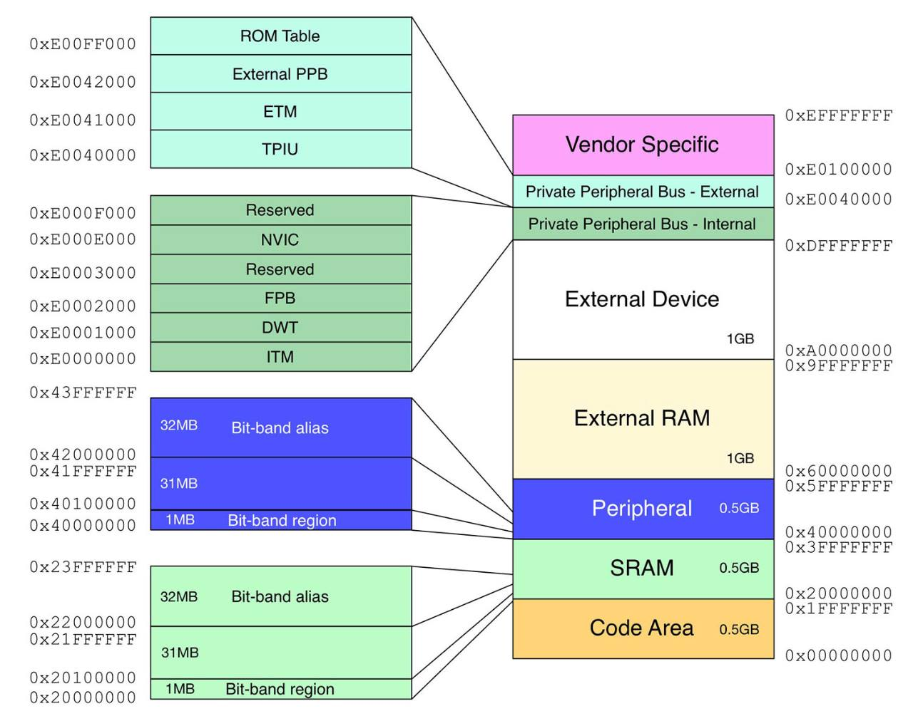

# What is a Memory Map?

A memory map describes the Physical, Silicon Addresses on a microchip! You can only access these if you're doing baremetal or kernel programming. All other programs are given a Virtual Memory Map with nothing dangerous! The real memory map can usually be found in the chips "Technical Reference Manual" and usually looks like this:

This isn't the Beaglebone's memory map! It's just an example. The Beaglebone Black uses a Sitara AM335x Arm Cortex-A8 chip from Texas Instruments and its memory map is HUGE. The Technical Reference Manual is thousands of pages long. The Beaglebone Black is one of the only single board computers where the vendor gives you the Technical Reference manual- most are closed source!
