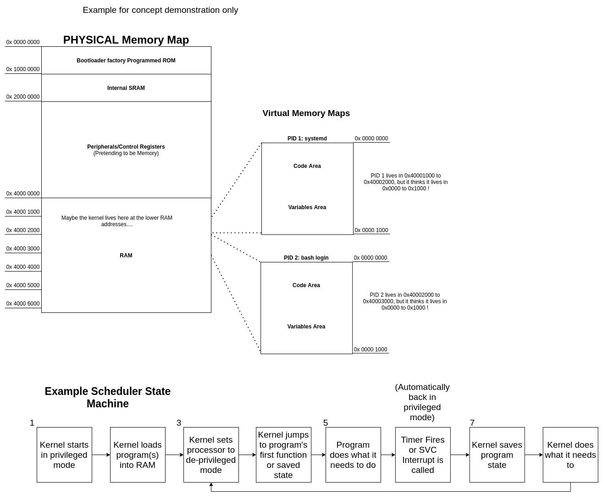

# What is privileged execution?

Privileged execution is the default state- access to everything. But you can go into a de-privileged mode to make things safer.

THIS IS THE BIG KAHUNA!!! Lets tie it all together.

1. The processor turns on, and (eventually, after the bootloader gets some basic stuff working) starts the kernel- which has privileged access (full access).
2. The kernel builds all the data-structures (file system, scheduler, etc) and starts the drivers.
3. The kernel and drivers together take this complicated and tedious "pretending to be memory" system used to control the processor (the previous post) and wrap it in nice APIs.
4. Now the kernel wants to start process #1, aka PID 1, and on most linux systems, this is systemd (which starts everything else like your bash logins and desktops). However, it does not want to give systemd direct access to any PHYSICAL MEMORY. Only the kernel and the drivers can do that.
5. So, what it does for PID 1 (and every other program): It loads the program into RAM and remembers the physical address where it loaded (lets say 0x6000,0000).
6. It sets a MMU w/ a virtual memory map, to pretend that the memory map starts at 0x6000,0000.... that is it makes 0x6000,0000 look like 0x0. That way the program's whole virtual memory map... is just the section of RAM the kernel gave it!
7. It puts the processor in de-privileged mode.
8. It jumps to the _start() function of the program (a built in function that calls the main() you write).... and runs the program!
9. How does it get out of de-privilege mode? It uses an interrupt like a hardware timer or SVC assembly instruction (any program can call SVC). The special thing about interrupts is that they are ALWAYS run in privileged mode. This is how the kernel takes back control from a program in de-privileged mode.

That's why we say the kernel and drivers run in **KERNEL SPACE** and the programs run in **USER SPACE**.

...and we will be breaking all these rules.

Next up we'll talk about the file system, then device tree, and then we'll start the hacking.

The image below shows an example state machine and memory map:

