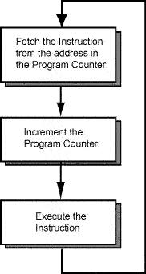

# What is a program counter?

The **Program Counter** is a bit of memory INSIDE the main processor that holds the exact line number that is being executed. The program counter is usually incremented as that bit of code is finished, but can be made to jump (to call a function), and forcibly overwritten by a hardware interrupt. It MUST hold the address of memory that is executable (or else crash)!

On the BBB, this means it must point to the on-chip ROM (factory program code, read-only), external RAM, on-chip SRAM, or external NOR Flash (BBB has none).

Generally, LOTS of memory addresses are not executable. Even if you can store code in certain memory addresses, that doesn't mean the memory address is executable. On the BBB (Sitara AM3358 chip), everything can be executed.... DOESN'T MEAN ITS A GOOD IDEA!

Linux always copies programs into RAM to execute them! Small chips (like Arm Cortex-M0s, arduions) have non-volatile flash memory and the processor can execute that memory directly.
